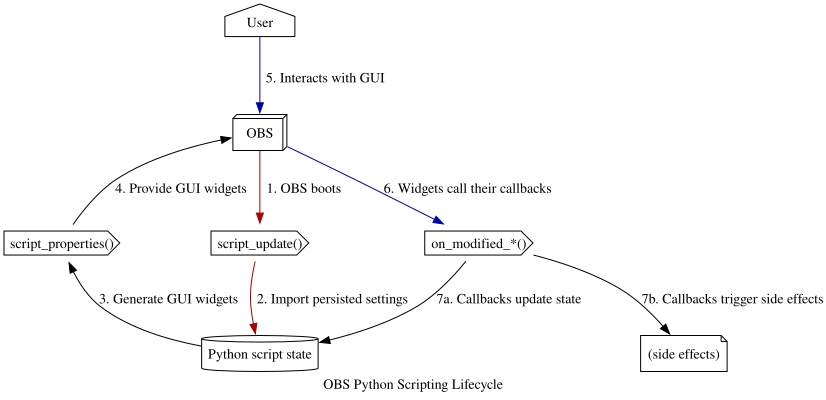

# Notes

The OBS Python scripting bridge is... an interesting duck. **A LOT** of the time spent on this project was testing and understanding how OBS was interacting with the python script, in what order, with what conditions, etc.

Collected here are various notes and observations on writing a python script intended to extend OBS Studio.

## Script Architecture

Split into a few distinct parts, because the Twitch OAuth token that OBS walks you through obtaining during first-run setup doesn't request all of the necessary scopes.

1. Walking the user through obtaining a Twitch API token.
1. Managing/creating a text source to display the count-up timer on screen.
1. Connecting to chat (IRC or EventSub) for the correct channel and processing ! commands.

## Example lifecycle

<table><!-- markdownlint-disable MD033 -->
<thead>
    <tr>
        <th>Event</th>
        <th>Function</th>
        <th>Responsibilities</th>
    </tr>
</thead>
<tbody>
    <tr>
        <td>OBS launches</td>
        <td><code>script_description()</code></td>
        <td>Called once BEFORE load in order to show the GUI description in OBS's Scripts pane. Returns a Qt compatible HTML-subset string.</td>
    </tr>
    <tr>
        <td>&nbsp;</td>
        <td><code>script_defaults(settings: obs_data_t)</code></td>
        <td>OBS prepopulates values for any GUI properties that it might encounter later. If the script hasn't been run previously, any default value defined here will be used instead of the one saved in the OBS user's profile json config file.</td>
    </tr>
    <tr>
        <td>&nbsp;</td>
        <td><code>script_load(settings: obs_data_t)</code></td>
        <td>Called once when OBS "boots up" this script. OBS provides the script with stored (or default) values for all settings widgets. This call happens <b>early</b> in OBS startup, so the GUI won't be ready yet. (You can't create sources or modify scenes here.) That means you can't query the available scenes/sources/services yet.  For our purposes, we use this to initialize the script's runtime state, register an event router callback, and register the specific events we want to listen to.</td>
    </tr>
    <tr>
        <td>&nbsp;</td>
        <td><code>script_properties()</code></td>
        <td>Use the script's runtime data (**not** OBS's persistent obs_data_t settings!) to draw GUI controls.Properties should be stateless and unconditional. Their presence or absence should be controlled with <code>obs_property_set_visible(prop, bool)</code> calls <i>elsewhere</i>, and not python <code>if: else:</code> statements here. </td>
    </tr>
    <tr>
        <td>User changes this script's GUI properties</td>
        <td>Any <code>obs_property_set_modified_callback(props: obs_properties_t, prop: str, callback_func: callable)</code> registered callback</td>
        <td>These callbacks are the script's only opportunity to <b>modify</b> the GUI properties in realtime (without having to fully reload the script.) It's also the place for side-effects to happen, based on the widget that was modified, and its new value. The boolean return value signals whether a GUI redraw is needed.</td>
    </tr>
    <tr>
        <td>&nbsp;</td>
        <td><code>todo</code></td>
        <td></td>
    </tr>
    <tr>
        <td>&nbsp;</td>
        <td><code>script_update(settings: obs_data_t)</code></td>
        <td>Used to propagate any OBS settings changes to the script's own runtime state.</td>
    </tr>
    <tr>
        <td><code>OBS_FRONTEND_EVENT_FINISHED_LOADING</code></td>
        <td>A registered <code>obs_frontend_add_event_callback()</code> event handler</td>
        <td>The only thing we do specifically is set a script state flag letting the rest of the code know the OBS GUI is now available for use.</td>
    </tr>
    <tr>
        <td>&nbsp;</td>
        <td><code>todo</code></td>
        <td></td>
    </tr>
    <tr>
        <td><code>[Connect Twitch]</code> button clicked</td>
        <td>A registered <code>obs_properties_add_button(props, 'button_name', 'Button Label', button_click_callback)</code> callback</td>
        <td>The <code>button_click_callback(props, prop, settings)</code> must enact whatever the button is meant to do. For us that means opening the OAuth kickoff URL.</td>
    </tr>
    <tr>
        <td>&nbsp;</td>
        <td><code>todo</code></td>
        <td></td>
    </tr>
    <tr>
        <td><code>[Disonnect Twitch]</code> button clicked</td>
        <td>A registered <code>obs_properties_add_button(props, 'button_name', 'Button Label', button_click_callback)</code> callback</td>
        <td>The <code>button_click_callback(props, prop, settings)</code> must enact whatever the button is meant to do. For us that means clearing the script's internal Twitch API creds from memory (which OBS will persist to disk for us).</td>
    </tr>
    <tr>
        <td>&nbsp;</td>
        <td><code>todo</code></td>
        <td></td>
    </tr>
    <tr>
        <td>OAuth token pasted into property widget</td>
        <td>Any <code>obs_property_set_modified_callback(props: obs_properties_t, prop: str, callback_func: callable)</code> registered callback</td>
        <td>Validates the token and makes the Twitch API calls to obtain the expiration time, confirm the required scopes are present for the token, and fetch the broadcaster_id and channel name for use with IRC.</td>
    </tr>
    <tr>
        <td>&nbsp;</td>
        <td><code>todo</code></td>
        <td></td>
    </tr>
    <tr>
        <td><code>OBS_FRONTEND_EVENT_STREAMING_STARTING</code></td>
        <td>A registered <code>obs_frontend_add_event_callback()</code> event router/handler</td>
        <td>This handler will get called for <b>ALL  events, so it either needs to branch on the provided <code>OBS_FRONTEND_EVENT_*</code> value, or farm out to individual handlers, which makes it more of an event <i>router</i>.</td>
    </tr>
    <tr>
        <td>&nbsp;</td>
        <td><code>todo</code></td>
        <td></td>
    </tr>
    <tr>
        <td>OBS calls every rendered frame</td>
        <td><code>script_tick()</code></td>
        <td>(Nothing-- we don't need to touch rendered frames.)</td>
    </tr>
    <tr>
        <td>Mod enters <code>!brb</code> in chat</td>
        <td>IRC background socket thread calls <code>BRBScript.on_chat</code> callback</td>
        <td></td>
    </tr>
    <tr>
        <td>&nbsp;</td>
        <td><code>todo</code></td>
        <td></td>
    </tr>
    <tr>
        <td>&nbsp;</td>
        <td><code>todo</code></td>
        <td></td>
    </tr>
    <tr>
        <td>Chatter enters <code>!at mm:ss</code> in chat</td>
        <td>IRC background socket thread calls <code>BRBScript.on_chat</code> callback</td>
        <td></td>
    </tr>
    <tr>
        <td>&nbsp;</td>
        <td><code>todo</code></td>
        <td></td>
    </tr>
    <tr>
        <td>&nbsp;</td>
        <td><code>todo</code></td>
        <td></td>
    </tr>
    <tr>
        <td>Mod enters <code>!back</code> in chat</td>
        <td>IRC background socket thread calls <code>BRBScript.on_chat</code> callback</td>
        <td></td>
    </tr>
    <tr>
        <td>&nbsp;</td>
        <td><code>todo</code></td>
        <td></td>
    </tr>
    <tr>
        <td>&nbsp;</td>
        <td><code>todo</code></td>
        <td></td>
    </tr>
    <tr>
        <td><code>OBS_FRONTEND_EVENT_STREAMING_STOPPING</code></td>
        <td>A registered <code>obs_frontend_add_event_callback()</code> event router/handler</td>
        <td></td>
    </tr>
    <tr>
        <td>&nbsp;</td>
        <td><code>todo</code></td>
        <td></td>
    </tr>
    <tr>
        <td>OBS shuts down</td>
        <td><code>script_save(settings: obs_data_t)</code></td>
        <td></td>
    </tr>
    <tr>
        <td>&nbsp;</td>
        <td><code>script_unload()</code></td>
        <td>We ensure any running background irc socket threads are shut down, unregister all callback handlers, stop any still-running timers, and make our internal state 'clean'.</td>
    </tr>
</tbody>
</table>

### Twitch OAuth Flow

1. A button in this script's properties is presented in the GUI "Scripts" pane to kick off the Twitch OAuth implicit grant process.
    - This git repo hosts an oauth [kickoff page](/pages/start.html) that contains a button to request Twitch API credentials.
    - In the foreground, the user's default web browser is opened to a Twitch OAuth authorization page.
    - When the user confirms, Twitch redirects the user back to the hosted [destination page](/pages/destination.html).
    - The URL fragment (after the `#`) will contain the Twitch auth token (not an API "access" token.)
    - Some Javascript embedded in the landing page extracts the auth token and displays it for easy pasting into OBS.
1. Once this process completes, this script has the Twitch API access it needs to:
    - determine the broadcaster_id and channel name,
    - connect to chat to listen for messages and post its own,
1. This implicit grant type eventually expires. When this script starts up, it checks the expiry date and re-prompts for authorization when necessary.

### Text Source Management (in OBS's) front end

1. When the plugin loads:
    - It checks to see if an existing text Source already exists in the current scene.
    - If OAuth credentials don't already exist, it warns about configuration in its Properties.
    - If a text Source doesn't already exist, it creates one with some defaults.
    - It creates a new "session" for managing !brb state and any registered guesses.
    - It connects to the channel's IRC chat (via EventSub WeebSocket api) to listen for commands and send feedback messages.
1. While the stream is running, the chat commands will signal the script to show+start or hide+stop the on-screen count-up timer's text Source.

## OBS Scripting Notes and Lessons Learned

OBS Scripting API call order:

- `script_description`
- `script_load`
- `script_update`
- `script_defaults`
- `script_properties` (called when OBS needs to render the GUI control widgets for this script.)
    - `on_some_prop_modified` -> returns True (if any of those widgets has a 'modified' callback, and that callback returns True...)
        - `script_properties` (OBS calls the properties function again, which should presumably take the now-loaded runtime state into account when choosing what widgets to display.)
    - `on_diff_prop_modified` -> returns True (each widget has to register its own callback. Could be the same method, but that makes detecting which widget _caused_ the callback more tricky. But! Each callback gets access to the full properties set and can make modifications to more than the single prop that triggered the callback to begin with.)

- `on_start_button` (button callback, changes runtime state and starts a timer)
    - ticker (timer runs every X ms as defined by on_start_button. Checks runtime state to see if it should _keep_ running.)

- `on_stop_button` (button callback, changes runtime state to signal to the timer that it should unregister itself and stop processing.)

- `script_save` (only called by OBS in specific situations, like after fronend events such as OBS_FRONTEND_EVENT_STREAMING_STARTING)

- `script_unload` (called once when OBS is terminating this script. Absolutely **every** source, scene, sceneitem, data, etc needs to be `obs_*_release()`d to prevent OBS from crashing and potentially wiping the user's configured scenes and sources. This applies ONLY to objects **created by this script**. Objects passed into this script's interface functions are released by OBS itself.)
